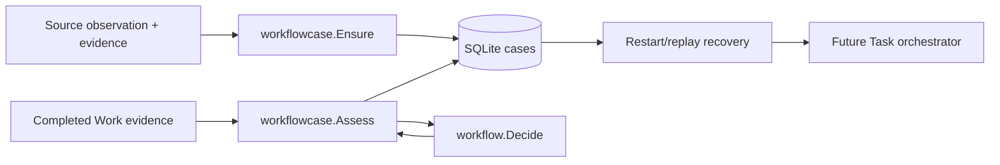

# Durable Workflow Cases Implementation Plan

> **For agentic workers:** REQUIRED SUB-SKILL: Use superpowers:subagent-driven-development to implement this plan task-by-task. Steps use checkbox (`- [ ]`) syntax for tracking.

**Goal:** Persist a generic Mission case for each observation revision and atomically record each Work assessment and its next-work/hold/verification decision.

**Architecture:** `internal/workflow` remains a pure decision kernel. A new `internal/workflowcase` service owns SQLite case/assessment records and calls `workflow.Decide` inside transactions. It does not create Task/Attempt rows, dispatch effects, authenticate credentials, or mark a case complete; those are later orchestration boundaries. Existing `purpose.Service` validates that a Mission is active when a case is first created.

**Architecture Diagram:**



**Tech Stack:** Go 1.27, SQLite/goose migrations, existing `clock.Clock`, `purpose.Service`, `internal/workflow`, Go tests.

> [!IMPORTANT]
> This is a ledger, not an authorization system. A future runner must prove evidence existence, use the current signed Owner grant, check current revision/lease/policy and authorize effects immediately before dispatch. No ADO write is enabled by this plan.

---

### Task 1: Schema and idempotent observation-to-case creation

**Files:**
- Create: `internal/state/sqlite/migrations/00013_workflow_cases.sql`
- Create: `internal/workflowcase/service.go`
- Create: `internal/workflowcase/service_test.go`

- [ ] **Step 1: Write the failing tests.** `TestEnsureCaseDeduplicatesObservationRevision` opens `testutil.OpenStore(t)`, creates an active Mission with `purpose.New(store, clock).CreateMission`, calls `Service.Ensure` twice for `Observation{MissionID, Source:"source-a", ObjectID:"item-1", RevisionID:"r1", EvidenceID:"e1", FirstWork:{Kind:"inspect", RequiredCapabilities:["read"], AuthorityCeiling:["read"]}, Grant:{Capabilities:["read"]}, MaxSteps:3, RemainingBudget:5}`, and asserts the same `Case.ID` and `CurrentWorkID` and one database row. A different `RevisionID:"r2"` must yield a different case. `TestEnsureCaseRejectsInactiveMissionAndGrantChange` deactivates the Mission and expects creation to fail; a repeated key with a changed grant must fail rather than silently broaden the stored grant.
- [ ] **Step 2: Run red.** `go test ./internal/workflowcase -run 'TestEnsureCase' -count=1`; expect compile failure for missing package/API.
- [ ] **Step 3: Add migration.** `workflow_cases` columns: `case_id TEXT PRIMARY KEY`, `mission_id TEXT NOT NULL REFERENCES missions(mission_id)`, `source`, `object_id`, `revision_id`, `observation_evidence_id`, `initial_request_json`, `grant_json`, `state` (`ACTIVE`, `BLOCKED`, `READY_FOR_VERIFICATION`), `current_work_id`, `next_work_json`, `completed_steps`, `max_steps`, `remaining_budget`, `progress_signature`, `created_at`, `updated_at`; `UNIQUE(mission_id,source,object_id,revision_id)`. `workflow_assessments` is added in Task 2, not here. Add goose Up/Down sections and an index on `(state,updated_at)`.
- [ ] **Step 4: Implement `Service.Ensure` minimally.** Public API:

```go
type Observation struct {
    MissionID domain.ID
    Source, ObjectID, RevisionID, EvidenceID string
    FirstWork workflow.WorkProposal
    Grant workflow.Grant
    MaxSteps int
    RemainingBudget int64
}
type State string
const (Active State = "ACTIVE"; Blocked State = "BLOCKED"; ReadyForVerification State = "READY_FOR_VERIFICATION")
type Case struct {
    ID, MissionID, CurrentWorkID domain.ID
    Source, ObjectID, RevisionID, ObservationEvidenceID string
    State State
    NextWork workflow.WorkProposal
    Grant workflow.Grant
    CompletedSteps, MaxSteps int
    RemainingBudget int64
    ProgressSignature string
}
type Service struct { store *sqlite.Store; clock clock.Clock; purposes *purpose.Service }
func New(store *sqlite.Store, clk clock.Clock, purposes *purpose.Service) *Service
func (s *Service) Ensure(ctx context.Context, observation Observation) (Case, error)
```

   Require all identity/evidence strings nonblank, positive `MaxSteps`/`RemainingBudget`, and nonempty first-work kind. Validate the initial proposal against the grant by calling `workflow.Decide` with `Continue`, the real observation evidence ID, zero completed steps and the supplied limits; this is proposal validation, not evidence authentication. Serialize the immutable Observation into `initial_request_json`; on unique-key collision, load the existing case and require exact canonical JSON equality before returning it. Use one transaction for active-Mission validation, insert-or-read and return. Generate `case_id` and `current_work_id` with `domain.NewID`. Never update grant on replay.
- [ ] **Step 5: Run green and commit.** `go test ./internal/workflowcase -run 'TestEnsureCase' -count=1`; expect PASS. `git add internal/state/sqlite/migrations/00013_workflow_cases.sql internal/workflowcase/service.go internal/workflowcase/service_test.go && git commit -m "feat: persist idempotent workflow cases"`.

### Task 2: Atomic, replay-safe assessment transition

**Files:**
- Modify: `internal/state/sqlite/migrations/00013_workflow_cases.sql`
- Create: `internal/workflowcase/assessment.go`
- Create: `internal/workflowcase/assessment_test.go`

- [ ] **Step 1: Write failing tests.** `TestAssessContinueThenReady` creates a case, assesses its first work with `workflow.Assessment{Verdict:Continue,EvidenceIDs:["review-evidence"],Next:{Kind:"publish",RequiredCapabilities:["write"],AuthorityCeiling:["write"],ProposedActions:["comment"]}}` under a `read,write`/`comment` grant, asserts a new work ID and state ACTIVE, then assesses that new work with `Ready` and publication evidence and expects READY_FOR_VERIFICATION. `TestAssessReplayAndStaleWork` repeats the same first assessment and expects exactly the original result and one row; a changed payload for the same work ID and a stale work ID must fail. `TestAssessCannotIncreaseBudget` passes remaining budget larger than the stored amount and expects failure.
- [ ] **Step 2: Run red.** `go test ./internal/workflowcase -run 'TestAssess' -count=1`; expect compile failure for missing `Assess`.
- [ ] **Step 3: Extend migration.** Add `workflow_assessments(assessment_id TEXT PRIMARY KEY,case_id TEXT NOT NULL REFERENCES workflow_cases(case_id),work_id TEXT NOT NULL,request_json TEXT NOT NULL,result_json TEXT NOT NULL,created_at TEXT NOT NULL,UNIQUE(case_id,work_id))` and `(case_id,created_at)` index. `result_json` stores the whole original `AssessmentResult`, including the post-transition Case snapshot, so replay returns the same result even after later work. Place matching Down drops before `workflow_cases`.
- [ ] **Step 4: Implement `Assess` in one `store.WithTx`.** Public API:

```go
type AssessmentRequest struct {
    CaseID, WorkID domain.ID
    Assessment workflow.Assessment
    RemainingBudget int64
    ProgressSignature string
}
type AssessmentResult struct {
    Decision workflow.Decision
    Case Case
}
func (s *Service) Assess(context.Context, AssessmentRequest) (AssessmentResult, error)
```

   First look up `(case_id,work_id)` in `workflow_assessments`: identical serialized request returns the stored original result; a changed request errors. Otherwise require ACTIVE case, matching `current_work_id`, and an active Mission through `purpose.ValidatePurposeTx`; require `0 <= requested RemainingBudget <= stored RemainingBudget`; call `workflow.Decide` with `CompletedSteps=stored+1`, stored max/grant, supplied remaining budget, new and previous progress signatures. Insert request+result and update case state/step count/budget/signature atomically. On `CONTINUE`, generate and persist a new `current_work_id` and `next_work_json`; on `BLOCKED` or `READY_FOR_VERIFICATION`, clear next work/current work. A failed transaction must leave both tables unchanged. Do not treat a model-provided progress signature as proof of progress; the future orchestrator must compute it from durable evidence.
- [ ] **Step 5: Run green and commit.** `go test ./internal/workflowcase -run 'TestAssess' -count=1`; expect PASS. `git add internal/state/sqlite/migrations/00013_workflow_cases.sql internal/workflowcase/assessment.go internal/workflowcase/assessment_test.go && git commit -m "feat: persist guarded workflow assessments"`.

### Task 3: Restart and concurrent-replay verification

**Files:**
- Create: `internal/workflowcase/recovery_test.go`
- Modify: `internal/workflowcase/service.go`

- [ ] **Step 1: Write failing restart tests.** `TestCaseSurvivesStoreReopen` uses a temporary database path, creates Mission/case/first assessment, closes and reopens SQLite, calls `Service.Get` with case ID and confirms state, next work ID, step count and remaining budget. `TestConcurrentEnsureCreatesOneCase` runs two `Ensure` calls for the same key in goroutines and asserts the same case ID plus row count one. `TestFailedAssessmentDoesNotMutateCase` submits unauthorized proposed action, expects error and confirms state, step count and assessment row count unchanged.
- [ ] **Step 2: Run red.** `go test ./internal/workflowcase -run 'Test(CaseSurvivesStoreReopen|ConcurrentEnsureCreatesOneCase|FailedAssessmentDoesNotMutateCase)$' -count=1`; expect compile failure for missing `Get` or failing assertions.
- [ ] **Step 3: Implement `func (s *Service) Get(ctx context.Context, caseID domain.ID) (Case,error)` using the same row decoder as `Ensure`/`Assess`; no generic update method. Fix any discovered transaction/replay race through SQLite uniqueness and transactional reads, not a process-local mutex. Run `go test -race ./internal/workflowcase -count=1` and `go test ./internal/workflowcase -count=1`; expect PASS.
- [ ] **Step 4: Commit.** `git add internal/workflowcase/service.go internal/workflowcase/recovery_test.go && git commit -m "test: verify workflow case restart and replay safety"`.

### Task 4: Document boundary and verify repository

**Files:**
- Create: `internal/workflowcase/doc.go`
- Modify: `docs/superpowers/tasks/2026-09-23-ado-pr-review-task.md`

- [ ] **Step 1: Document the package.** State that `Ensure` deduplicates observations, `Assess` durably applies the pure decision, and no Task/Attempt, verifier, grant signature, evidence object, or external effect is created/checked here. Caller must bind work IDs to real Task/Attempt IDs and revalidate current Owner grant before effects.
- [ ] **Step 2: Update checklist.** Mark durable case/assessment ledger done but keep Task scheduling, ADO adapters, protected effects and live smoke test unchecked; link this plan.
- [ ] **Step 3: Verify.** Run `gofmt -w internal/workflowcase/*.go`, `go test ./internal/workflowcase -count=1`, `go test ./... -count=1` with loopback permission if needed, `go vet ./...`, and `git diff --check`. Expected: all pass. Run `graphify update .` after code edits; if unavailable/permission-denied, record the exact failure and remove only generated untracked cache files.
- [ ] **Step 4: Commit.** `git add internal/workflowcase/doc.go docs/superpowers/tasks/2026-09-23-ado-pr-review-task.md && git commit -m "docs: define durable workflow case boundary"`.

## Self-review and next boundary

This plan covers durable observation identity, deduplication, replay-safe assessment decisions, bounds, narrower proposed work, and restart recovery. It deliberately does not create or execute Tasks, verify final results, sign grants, or interact with ADO/Copilot. The next sub-project must link these case work IDs to existing Task/Attempt and Evidence primitives before any adapter can run.
