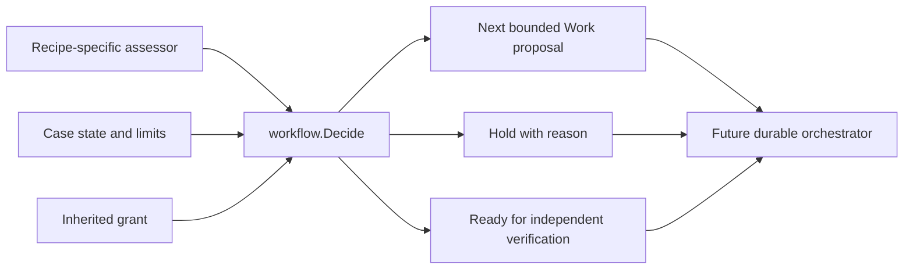

# Generic Mission Workflow Kernel Implementation Plan

> **For agentic workers:** REQUIRED SUB-SKILL: Use superpowers:subagent-driven-development to implement this plan task-by-task. Steps use checkbox (`- [ ]`) syntax for tracking.

**Goal:** Provide a deterministic, domain-neutral Work → Assessment → Work → Assessment → Verification decision kernel, with bounded continuation and no authority escalation.

**Architecture:** This first sub-project is a pure Go package. It does not poll ADO, execute Copilot, persist cases, or dispatch effects. Callers submit the latest completed work, assessment, limits, and inherited grant; the kernel validates the proposed next step and returns a decision. Persisted orchestration and the ADO recipe will be separate implementation plans, built on this contract. Keeping the kernel pure makes its safety rules independently testable before connecting it to credentials or external writes.

**Architecture Diagram:**



**Tech Stack:** Go 1.27 (`go.mod`); standard-library testing. No database or network dependencies in this sub-project.

**Scope boundary:** The approved [design](../specs/2026-09-23-generic-mission-workflow-design.md) remains the target. This plan delivers its reusable decision kernel only. Follow-on plans must deliver durable case/assessment storage and Task scheduling; then read-only ADO observation and Copilot review; then protected comment/vote effects and live-machine smoke testing. No automatic vote may be enabled by this kernel alone.

---

### Task 1: Define a validated, domain-neutral decision contract

**Files:**
- Create: `internal/workflow/decision.go`
- Create: `internal/workflow/decision_test.go`

- [ ] **Step 1: Write the failing contract tests.** Define `TestDecideReady`, `TestDecideContinueNarrowsAuthority`, and `TestDecideBlocksOnUnknown`. Use this table as the precise expected behavior:

```go
tests := []struct {
    name string
    assessment Assessment
    want Outcome
}{
    {"ready", Assessment{Verdict: Ready, EvidenceIDs: []string{"evidence-1"}}, OutcomeReady},
    {"unknown", Assessment{Verdict: Unknown, Reason: "review incomplete", EvidenceIDs: []string{"evidence-1"}}, OutcomeBlocked},
    {"continue", Assessment{Verdict: Continue, EvidenceIDs: []string{"evidence-1"}, Next: &WorkProposal{
        Kind: "second-step", RequiredCapabilities: []string{"read"}, AuthorityCeiling: []string{"read"},
    }}, OutcomeContinue},
}
```

   Each test calls `Decide(Input{Assessment: assessment, Grant: Grant{Capabilities: []string{"read", "write"}, Actions: []string{"comment"}}, Limits: Limits{MaxSteps: 3, RemainingBudget: 2}, CompletedSteps: 1})` and compares `Decision.Outcome`. The `continue` case also compares the returned `Next` to the requested proposal.

- [ ] **Step 2: Run the red test.** `go test ./internal/workflow -run 'TestDecide(Ready|ContinueNarrowsAuthority|BlocksOnUnknown)$' -count=1`; expect compile failure because `Decide` is undefined.

- [ ] **Step 3: Implement the contract and minimum decision logic.** The public types in `decision.go` are:

```go
type Verdict string
const (Ready Verdict = "READY"; Continue Verdict = "CONTINUE"; Unknown Verdict = "UNKNOWN")
type Outcome string
const (OutcomeReady Outcome = "READY_FOR_VERIFICATION"; OutcomeContinue Outcome = "CONTINUE"; OutcomeBlocked Outcome = "BLOCKED")
type Grant struct { Capabilities []string; Actions []string }
type WorkProposal struct { Kind string; RequiredCapabilities []string; AuthorityCeiling []string; ProposedActions []string }
type Assessment struct { Verdict Verdict; Reason string; EvidenceIDs []string; Next *WorkProposal }
type Limits struct { MaxSteps int; RemainingBudget int64 }
type Input struct { Assessment Assessment; Grant Grant; Limits Limits; CompletedSteps int; ProgressSignature string; PreviousProgressSignature string }
type Decision struct { Outcome Outcome; Reason string; Next *WorkProposal }
func Decide(Input) (Decision, error)
```

   `Decide` rejects missing evidence, invalid verdicts and a `Ready` assessment carrying a next-work proposal. `Unknown` always returns `OutcomeBlocked` with its reason. `Ready` returns `OutcomeReady` only after the evidence check. In this first commit, `Continue` requires a nonempty next-work kind; Task 2 adds the mandatory authority, budget and progress checks before this package may be integrated with any runner. Return a defensive copy of the proposal slices so callers cannot mutate an accepted decision after validation.

- [ ] **Step 4: Run the green test.** Same `go test` command; expect PASS.
- [ ] **Step 5: Commit.** `git add internal/workflow/decision.go internal/workflow/decision_test.go && git commit -m "feat: add generic workflow decision contract"`.

### Task 2: Enforce bounded progress and inherited authority

**Files:**
- Modify: `internal/workflow/decision.go`
- Modify: `internal/workflow/decision_test.go`

- [ ] **Step 1: Write failing table tests.** `TestDecideRejectsAuthorityGrowth` covers a proposed capability absent from the grant, required capability absent from the proposed ceiling, and proposed action absent from the grant. `TestDecideBlocksExhaustion` covers `CompletedSteps >= MaxSteps`, `RemainingBudget <= 0`, and identical nonempty progress signatures. Assert `OutcomeBlocked` for exhausted/no-progress cases and a non-nil error for invalid authority proposals. Neither outcome may contain `Next`.
- [ ] **Step 2: Run red tests.** `go test ./internal/workflow -run 'TestDecide(RejectsAuthorityGrowth|BlocksExhaustion)$' -count=1`; expect at least one failing assertion.
- [ ] **Step 3: Implement the checks inside `Decide` before returning `OutcomeContinue`.** Use a set-membership helper to require `Next.AuthorityCeiling ⊆ Grant.Capabilities`, `Next.RequiredCapabilities ⊆ Next.AuthorityCeiling`, and `Next.ProposedActions ⊆ Grant.Actions`. A child may omit capabilities/actions, but never add one. Evaluate limits and no-progress after authority validation; those produce a held decision with a specific reason, not an error. Do not infer grant entries from the assessment reason or work kind.
- [ ] **Step 4: Run green and race tests.** `go test ./internal/workflow -count=1 && go test -race ./internal/workflow -count=1`; expect PASS.
- [ ] **Step 5: Commit.** `git add internal/workflow/decision.go internal/workflow/decision_test.go && git commit -m "feat: bound workflow continuation by progress and authority"`.

### Task 3: Demonstrate the same kernel with two recipes

**Files:**
- Create: `internal/workflow/recipes_test.go`
- Modify: `internal/workflow/decision_test.go`

- [ ] **Step 1: Write an iterative test.** `TestReviewThenPublishThenVerify` sends a `Continue` assessment after review evidence with next kind `publish-decision`, then a `Ready` assessment after publication evidence. Assert the first decision is `CONTINUE`, the second is `READY_FOR_VERIFICATION`, and that the first decision contains only a proposed action, not a dispatched result. Use `Grant{Capabilities: []string{"ado.read", "ado.write", "ado.pr.comment", "ado.pr.approve"}, Actions: []string{"ado.pr.comment", "ado.pr.approve"}}`; give the second work only `ado.write` capability and one proposed action. Work 2 must carry the effect capabilities in its authority ceiling. The current Work kind is not an input to this pure post-work kernel; the durable orchestrator will own that association.
- [ ] **Step 2: Write a second recipe test.** `TestDocumentReviewThenArchiveThenVerify` uses different evidence, next-work kind `archive-report`, and different capability/action names; run the same `Continue` then `Ready` sequence. Check that `decision.go` imports no recipe-specific or I/O packages; Step 4 separately inspects the code for recipe-specific branches.
- [ ] **Step 3: Run both tests.** `go test ./internal/workflow -run 'Test(ReviewThenPublishThenVerify|DocumentReviewThenArchiveThenVerify)$' -count=1`; expect PASS if the contract from Tasks 1–2 is complete. If a test fails, fix the contract or fixture according to the failed assertion without adding recipe-specific switches.
- [ ] **Step 4: Inspect the package boundary.** Confirm `decision.go` imports no ADO or Copilot package and performs no I/O; no dynamic assertion can prove absence of an unconnected effect provider. The different recipes must use the same `Decide` function.
- [ ] **Step 5: Run all repository tests.** `go test ./... -count=1`; expect PASS. Also run `go vet ./...`; expect exit 0.
- [ ] **Step 6: Commit.** `git add internal/workflow/recipes_test.go internal/workflow/decision_test.go internal/workflow/decision.go && git commit -m "test: prove workflow kernel supports distinct recipes"`.

### Task 4: Document the integration boundary and verify the slice

**Files:**
- Create: `internal/workflow/doc.go`
- Modify: `docs/superpowers/tasks/2026-09-23-ado-pr-review-task.md`

- [ ] **Step 1: Add package documentation.** State that callers must durably record Assessment and case state; check current lease/fence, grant, revision and policy before any External Operation; reconcile unknown dispatch outcomes; and use an independent final verifier. State that `Decide` is a proposal validator, not an authorization or executor.
- [ ] **Step 2: Mark only the kernel slice complete in the task checklist.** Leave ADO integration and live-machine checks unchecked. Link this plan and the follow-on storage/adapter work.
- [ ] **Step 3: Verify.** Run `gofmt -w internal/workflow/*.go`, `go test ./... -count=1`, `go vet ./...`, and `git diff --check`; expect all to pass. Inspect `git diff` for accidental external-write wiring.
- [ ] **Step 4: Refresh the repository graph if available.** Run `graphify update .` when the CLI exists; otherwise record that the index tool is unavailable in this environment.
- [ ] **Step 5: Commit.** `git add internal/workflow/doc.go docs/superpowers/tasks/2026-09-23-ado-pr-review-task.md && git commit -m "docs: define workflow kernel integration boundary"`.

## Self-review against the approved design

- Covered here: reusable work/assessment decision, bounded continuation, narrower authority, uncertainty hold, independent-verification handoff, and tests with two work types.
- Intentionally in follow-on plans: durable case identity and assessment records, Task/Attempt scheduling and resource envelopes, Owner-signed grants and exact policy, ADO observation/read provider, Copilot CLI executor, protected comment/vote provider, restart/reconciliation, shadow rollout, and live ADO smoke test. This plan makes no claim that automatic PR review is available after the kernel slice.
- The key ordering is explicit: review is Work 1; publishing comments or `Approve` is Work 2. Each work result is assessed, then the case is independently verified. A held review cannot reach Work 2.
